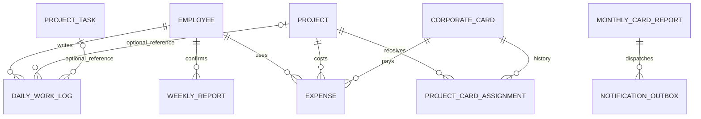
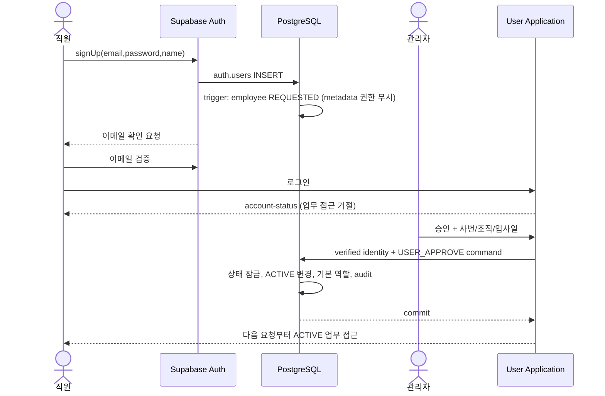
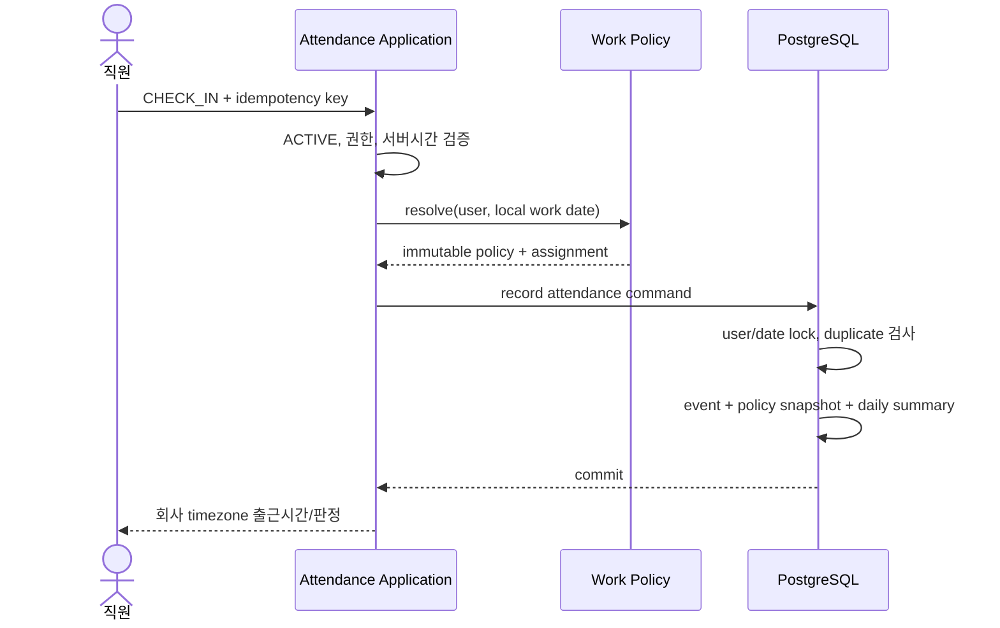
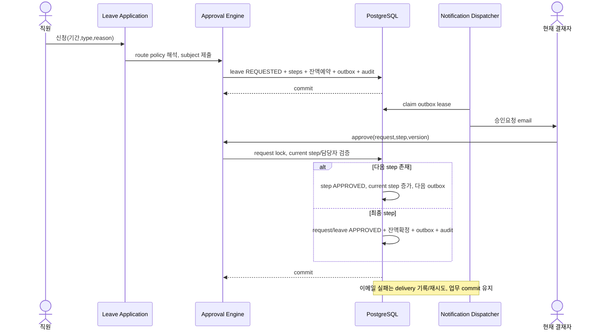
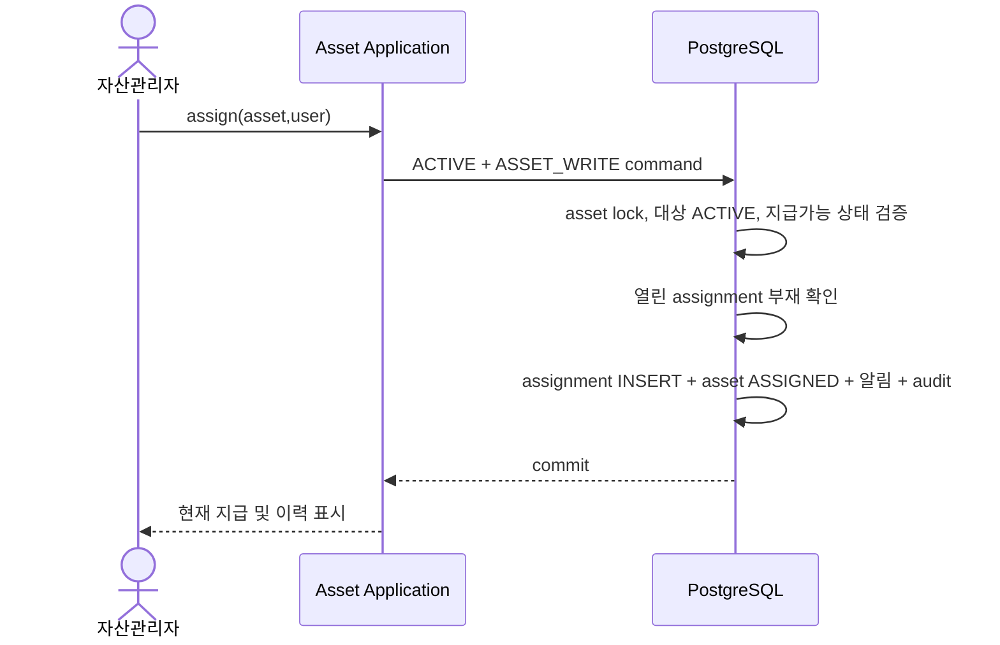
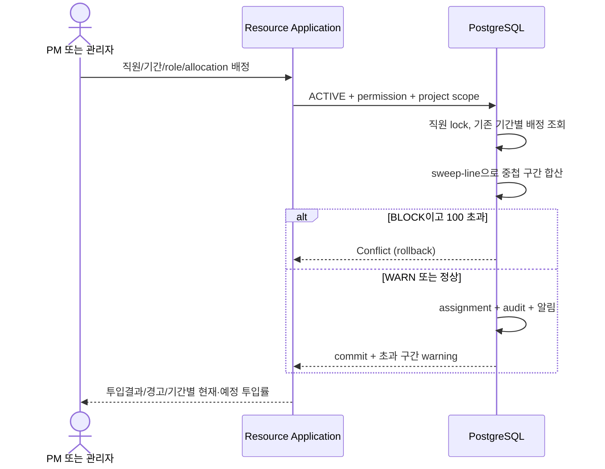

# Domain Model · 전체 목표 ERD

이 문서는 Phase 1~6의 목표 논리 모델이다. 현재 구현된 테이블은 supabase/migrations를 확인한다. FK 표기는 관계의 무결성을 의미하며 업무별 권한은 rbac.md를 따른다. 공통 created_at/updated_at은 가독성을 위해 일부 생략했다.

```mermaid
erDiagram
  AUTH_USERS ||--|| EMPLOYEES : identity
  ORGANIZATIONS o|--o{ ORGANIZATIONS : parent
  ORGANIZATIONS o|--o{ EMPLOYEES : belongs_to
  EMPLOYEES o|--o{ ORGANIZATIONS : leads
  POSITIONS o|--o{ EMPLOYEES : position
  TITLES o|--o{ EMPLOYEES : title
  EMPLOYEES ||--o{ USER_ROLES : holds
  ROLES ||--o{ USER_ROLES : grants
  ROLES ||--o{ ROLE_PERMISSIONS : includes
  PERMISSIONS ||--o{ ROLE_PERMISSIONS : permits
  EMPLOYEES ||--o{ USER_WORK_POLICY_ASSIGNMENTS : follows
  WORK_POLICIES ||--o{ USER_WORK_POLICY_ASSIGNMENTS : version
  WORK_CALENDARS ||--o{ CALENDAR_DAYS : defines
  WORK_CALENDARS ||--o{ WORK_POLICIES : calendar
  EMPLOYEES ||--o{ ATTENDANCE_EVENTS : records
  REGISTERED_DEVICES o|--o{ ATTENDANCE_EVENTS : verifies
  EMPLOYEES ||--o{ ATTENDANCE_DAILY_SUMMARIES : summarizes
  WORK_POLICIES ||--o{ ATTENDANCE_DAILY_SUMMARIES : snapshot_source
  ATTENDANCE_DAILY_SUMMARIES ||--o{ ATTENDANCE_CORRECTIONS : corrects
  EMPLOYEES ||--o{ LEAVE_REQUESTS : requests
  EMPLOYEES ||--o{ LEAVE_BALANCE_ENTRIES : balance
  LEAVE_REQUESTS o|--o{ LEAVE_BALANCE_ENTRIES : reserves
  APPROVAL_SUBJECTS ||--o| LEAVE_REQUESTS : typed_reference
  APPROVAL_SUBJECTS ||--o{ APPROVAL_REQUESTS : submitted
  APPROVAL_ROUTING_POLICIES ||--o{ APPROVAL_REQUESTS : snapshots
  EMPLOYEES ||--o{ APPROVAL_REQUESTS : requester
  APPROVAL_REQUESTS ||--|{ APPROVAL_REQUEST_STEPS : ordered
  EMPLOYEES ||--o{ APPROVAL_REQUEST_STEPS : approver
  EMPLOYEES ||--o{ NOTIFICATIONS : receives
  NOTIFICATIONS o|--o{ NOTIFICATION_OUTBOX : delivers
  NOTIFICATION_OUTBOX ||--o{ EMAIL_DELIVERY_ATTEMPTS : retries
  ASSETS ||--o{ ASSET_ASSIGNMENTS : history
  EMPLOYEES ||--o{ ASSET_ASSIGNMENTS : assigned_to
  ASSETS o|--o{ REGISTERED_DEVICES : registers
  EMPLOYEES o|--o{ PROJECTS : manages
  PROJECTS ||--o{ PROJECT_ASSIGNMENTS : staffing
  EMPLOYEES ||--o{ PROJECT_ASSIGNMENTS : participates
  EMPLOYEES o|--o{ COMPANY_SETTINGS : updates
  EMPLOYEES o|--o{ AUDIT_LOGS : actor

  AUTH_USERS {
    uuid id PK
    text email
  }
  EMPLOYEES {
    uuid id PK,FK
    text employee_number UK
    text name
    text email UK
    text phone
    date join_date
    date resignation_date
    uuid organization_id FK
    uuid position_id FK
    uuid title_id FK
    text employment_type
    text user_status
    text profile_image
    int version
  }
  ORGANIZATIONS {
    uuid id PK
    text name
    text organization_type
    uuid parent_id FK
    uuid leader_user_id FK
    int sort_order
    boolean active
    timestamptz created_at
    timestamptz updated_at
  }
  POSITIONS {
    uuid id PK
    text code UK
    text name
    int sort_order
    boolean active
  }
  TITLES {
    uuid id PK
    text code UK
    text name
    int sort_order
    boolean active
  }
  ROLES {
    uuid id PK
    text code UK
    text name
    boolean system
    boolean active
  }
  PERMISSIONS {
    uuid id PK
    text code UK
    text description
  }
  ROLE_PERMISSIONS {
    uuid role_id PK,FK
    uuid permission_id PK,FK
  }
  USER_ROLES {
    uuid user_id PK,FK
    uuid role_id PK,FK
    uuid granted_by FK
    timestamptz created_at
  }
  WORK_POLICIES {
    uuid id PK
    text code
    int version
    time check_in_time
    time check_out_time
    time break_start
    time break_end
    int late_grace_minutes
    text timezone
    int_array working_days
    uuid calendar_id FK
  }
  USER_WORK_POLICY_ASSIGNMENTS {
    uuid id PK
    uuid user_id FK
    uuid work_policy_id FK
    date effective_from
    date effective_to
  }
  WORK_CALENDARS {
    uuid id PK
    text name
    text timezone
  }
  CALENDAR_DAYS {
    uuid calendar_id PK,FK
    date work_date PK
    boolean working
    text reason
  }
  ATTENDANCE_EVENTS {
    uuid id PK
    uuid user_id FK
    text event_type
    timestamptz occurred_at
    uuid device_id FK
    inet ip_address
    text verification_type
    text verification_status
    uuid idempotency_key
  }
  ATTENDANCE_DAILY_SUMMARIES {
    uuid id PK
    uuid user_id FK
    date work_date
    timestamptz check_in_at
    timestamptz check_out_at
    int worked_minutes
    text status
    jsonb status_flags
    uuid work_policy_id FK
    jsonb policy_snapshot
    timestamptz shift_start_at
    timestamptz shift_end_at
    text calculation_version
  }
  ATTENDANCE_CORRECTIONS {
    uuid id PK
    uuid summary_id FK
    uuid actor_user_id FK
    text reason
    jsonb before_data
    jsonb after_data
    timestamptz created_at
  }
  LEAVE_REQUESTS {
    uuid id PK
    uuid user_id FK
    text leave_type
    date start_date
    date end_date
    numeric duration
    text reason
    text status
    uuid approval_subject_id FK,UK
    timestamptz created_at
  }
  LEAVE_BALANCE_ENTRIES {
    uuid id PK
    uuid user_id FK
    text leave_type
    numeric amount
    text entry_type
    uuid leave_request_id FK
    text idempotency_key UK
  }
  APPROVAL_SUBJECTS {
    uuid id PK
    text request_type
    uuid reference_id
  }
  APPROVAL_ROUTING_POLICIES {
    uuid id PK
    text request_type
    int version
    jsonb conditions
    boolean active
  }
  APPROVAL_REQUESTS {
    uuid id PK
    uuid subject_id FK
    text request_type
    uuid reference_id
    uuid requester_id FK
    text status
    int current_step_order
    uuid routing_policy_id FK
    jsonb route_snapshot
    timestamptz created_at
  }
  APPROVAL_REQUEST_STEPS {
    uuid id PK
    uuid approval_request_id FK
    int step_order
    text approver_type
    uuid approver_id FK
    text status
    timestamptz approved_at
    text comment
  }
  NOTIFICATIONS {
    uuid id PK
    uuid user_id FK
    text type
    text title
    text message
    text reference_type
    uuid reference_id
    timestamptz read_at
    timestamptz created_at
  }
  NOTIFICATION_OUTBOX {
    uuid id PK
    uuid notification_id FK
    text event_key UK
    text recipient
    text template
    jsonb payload
    text status
    int attempt_count
    timestamptz next_attempt_at
    timestamptz lease_until
  }
  EMAIL_DELIVERY_ATTEMPTS {
    uuid id PK
    uuid outbox_id FK
    int attempt
    text provider
    text provider_message_id
    text status
    text error_code
    timestamptz attempted_at
  }
  ASSETS {
    uuid id PK
    text asset_code UK
    text asset_type
    text manufacturer
    text model
    text serial_number UK
    date purchase_date
    date warranty_end_date
    text status
    text memo
  }
  ASSET_ASSIGNMENTS {
    uuid id PK
    uuid asset_id FK
    uuid user_id FK
    timestamptz assigned_at
    timestamptz returned_at
    uuid assigned_by FK
    text return_condition
    text memo
  }
  REGISTERED_DEVICES {
    uuid id PK
    uuid device_id UK
    uuid asset_id FK
    text hostname
    text serial_number
    bytea mac_hash
    text os
    bytea device_token_hash
    int version
    timestamptz registered_at
    timestamptz last_seen_at
    boolean active
  }
  PROJECTS {
    uuid id PK
    text project_code UK
    text project_name
    text customer_name
    text description
    date planned_start_date
    date planned_end_date
    date actual_start_date
    date actual_end_date
    text status
    uuid project_manager_id FK
  }
  PROJECT_ASSIGNMENTS {
    uuid id PK
    uuid project_id FK
    uuid user_id FK
    text project_role
    date planned_start_date
    date planned_end_date
    date actual_start_date
    date actual_end_date
    numeric allocation_rate
    text status
    text memo
  }
  COMPANY_SETTINGS {
    text key PK
    jsonb value
    int version
    uuid updated_by FK
  }
  AUDIT_LOGS {
    uuid id PK
    uuid actor_user_id FK
    text action
    text entity_type
    text entity_id
    jsonb before_data
    jsonb after_data
    inet ip_address
    text request_id
    timestamptz created_at
  }
```

## 직원 업무관리와 법인카드

WeeklyReport는 Employee + Week 단위이며 `entries_snapshot`은 확정 후 DailyWorkLog가 바뀌어도 유지된다. Expense는 거래일의 ProjectCardAssignment를 검사한다. MonthlyCardReport는 기준월 Expense를 스냅샷으로 저장하고, 이메일 발송 상태는 기존 Outbox/Attempt에서 추적한다.

## 회원가입 승인

## 출근

## 휴가신청 및 순차 승인

## 자산 지급

## 프로젝트 투입

## Phase 10 출퇴근 검증 관계

`RegisteredDevice → Asset ← AssetAssignment → Employee` 관계로 지급 PC를 확인한다. `AttendanceNetworkPolicy`와 직원별 기간 `AttendanceRemoteException`은 출퇴근 검증의 참조 정책이다. `AttendanceVerification`은 Employee/행동별 단기 증거이며 `READY → CONSUMED`일 때만 기존 `AttendanceEvent`가 optional verification FK를 갖는다. FAILED 증거는 Event가 아니므로 `AttendanceDailySummary`에 영향을 주지 않는다. 조직의 nullable 고유 `code`는 다음 Phase의 CSV 업무키를 위한 증분 필드다.

## Phase 11 인력프로필과 인력 계획

`Employee 1:1 WorkforceProfile`은 인사 마스터와 전문 경력을 분리한다. `WorkforceEducation`, `EmployeeSkill → Skill`, `WorkforceCertification`은 직원 프로필의 이력이다. `WorkforceProjectExperience`의 manual 항목은 과거 경력, internal 항목은 기존 `ProjectAssignment → Project`를 참조하는 직원별 경력 서술이다. 내부 프로젝트 정체성과 일정·역할은 기존 Project/Assignment만 수정한다. 프로젝트 종료 시 직원이 자신의 투입 이력을 선택해 주요 업무를 확인하고 반영한다.

`Project 1:N ProjectStaffingRequirement`는 수요이며 `ProjectStaffingRequirementSkill`은 필수/우대 기술, `ProjectStaffingFulfillment → ProjectAssignment`는 실제 배정의 수요 충족 관계다. 배정 자체와 가용률은 기존 Project Resource 도메인이 소유한다. 후보 검색은 기술 일치 건수와 기간 최저 가용률을 설명 가능한 참고정보로 제공한다. Skill Level은 평가 점수가 아니다.
